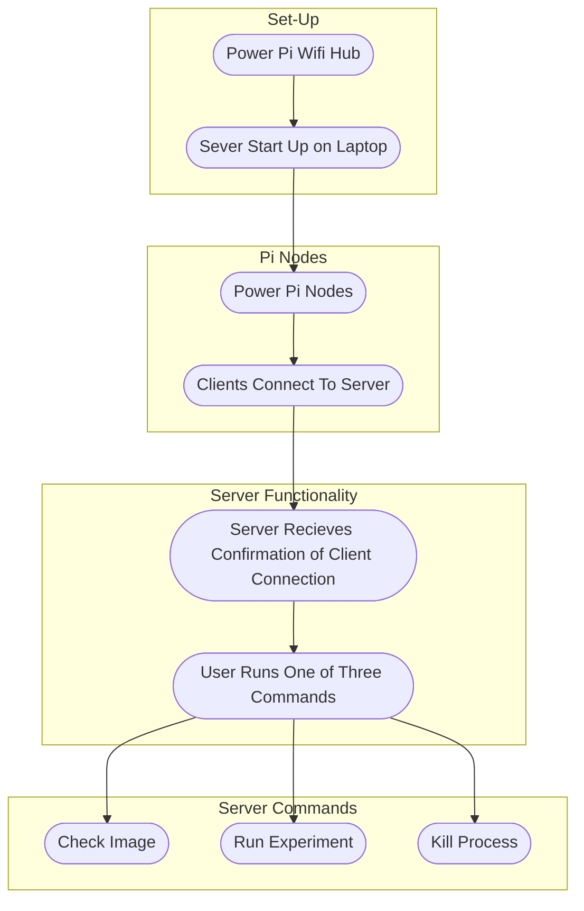

# Server-Client Field Trap Process

* Check Image Process: 
  * Sever sends the client a message stating that a particular thread needs to send an image back
  * The client recieves the message, and it runs a function taking a single image
  * This single image is then processed and converted into a byte format (NEED TO FIGURE THIS OUT!)
  * Then in the byte form the message is send back to the server
  * The server recieves the message 
  * The server then translates the message and converts the bytes into a viewable image.
  * THIS PROCESS COULD ALSO BE PERFORMED VIA WIRELESS OR WIRED SSH INTO EACH DEVICE...

* Run Experiment: [CONFIRMATION,TIME_OF_EXPERIMENT]
  * The user will select this function for the server to perform
  * However, before the message is sent, the user will need to provide the time at which the experiment will start. (THIS IS SO THAT THE PI's WILL START AT THE SAME TIME)
  * The time will be translated into byte form and put into a list with the initial confirmation that the experiment will be run and the second index being the time of start.
  * The clients will all recieve this and start the timelapse script. (THERE WILL BE A DELAY IN START BASED ON WHAT WAS INPUTTED AS TIME OF EXPERIMENT)
  * Every X number of frames for each trap the server will recieve information on the most recent image file name and the time in HH:MM:SS. In addition image files will be sent every once and awhile from the trips for the user to examine

* Kill Process
  * This will kill the current process. Which will primarily be the experiment, but will also work for the single image process.
  * By performing the kill process all clients will halt their current objective. This will also disconnect the clients from the server
  * After the clients have been disconnected the Server can be fully shutdown, and the clients can be disconnected from power.

# General Work Flow:

